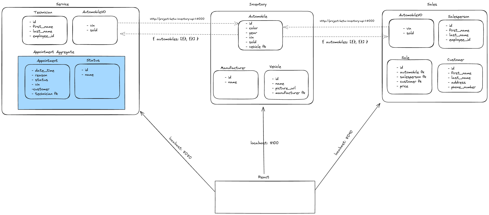

# CarCar

Team:

* Austin - Service
* Peace - Sales

## Getting Started

**Make sure you have Docker, Git, and Node.js 18.2 or above**

1. Fork this repository
https://gitlab.com/akim24/project-beta

2. Clone the forked repository onto your local computer:
git clone <https://gitlab.com/akim24/project-beta.git>

3. Build and run the project using Docker with these commands:
```
docker volume create beta-data
docker-compose build
docker-compose up
```
- After running these commands, make sure all of your Docker containers are running

- View the project in the browser: http://localhost:3000/

## Diagram



## High Level Overview

CarCar is made up of three microservices (bounded contexts) interacting with each other and a postgres database for each:

- *Inventory*
- *Service*
- *Sales*

## Service microservice

**Service-specific Getting Started:**

*Note to user:* This step is critical in order to create an appointment. If this step is skipped, a "Status.DoesNotExist" error will be raised and the appointment creation will be unsuccessful.

```
Run docker exec -it project-beta-service-api-1 bash
Run python manage.py createsuperuser
Follow prompts and create a username and password (creating an email is optional)
Type http://localhost:8080/admin/ into your browser and login using the credentials for the admin account you just created
Click into Statuses
Create:
    1. A status with the following two property values:
        - Name: "Created"
        - Id: 0
    2. A status with the following two property values:
        - Name: "Canceled"
        - Id: 1
    3. A status with the following two property values:
        - Name: "Finished"
        - Id: 2


```

**Models Description:**

```

I created four models Technician, Appointment, AutomobileVO and Status.

The Technician model is an entity designed so that each Technician object added to the database would keep track of its:
- *first_name*
- *last_name*
- *employee_id*

The Appointment model is an entity designed so that each Appointment object added to the database would keep track of its:
- *date_time*
- *reason*
- *status*
- *vin*
- *customer*
- *special_vip*
- *technician*

The Status model is a value object designed so that for each Appointment object added to the database through the Appointment model entity, a status property with a default value of "Created" is added to that Appointment object. This status property is not something that is input by a user (both in the backend and frontend) and is handled by three custom methods (create, cancel, finish) defined in the Appointment model itself.

The AutomobileVO model is a value object designed so that for each Automobile object added to the database through the Automobile model entity defined in the Inventory microservice, a reference copy of that Inventory object (AutomobileVO object) is created that tracks only the properties from the Automobile model that we explicitly define in the AutomobileVO model:
- *vin*
- *sold*

We use a Service Poller to access each Automobile that has been created in the database and to create a corresponding AutomobileVO, bridging the gap between our Service and Inventory microservices and allowing each Appointment object to check if the *vin* input by the customer who is making the appointment matches the *vin* of an automobile in our inventory (and if the *sold* property of that matching automobile is true or false) - allowing us to determine if the customer is a VIP or not (through our *special_vip* property).

```

**API Endpoints**

```

*Technicians*
| Action | Method | URL
| ---------- | ---------- | ----------
| List Technicians | GET | http://localhost:8080/api/technicians/
-----------------------------------------------------------------
| Create a Technician | POST | http://localhost:8080/api/technicians/
---------------------------------------------------------------------
| Delete a specific Technician | DELETE | http://localhost:8080/api/technicians/id/
-----------------------------------------------------------------------------------

```

*When requesting the list of technicians in the database, the JSON response will look like this:*
```
{
	"technicians": [
		{
			"first_name": "Austin",
			"last_name": "Kim",
			"employee_id": "A123",
			"id": 1
		}
	]
}

```

*To create a new technician, send a JSON body following this format:*
```
{
	"first_name": "Austin",
	"last_name": "Kim",
	"employee_id": "A123"

}

```

*When deleting a specific technician, the JSON response will look like this (if the inputted technician id does not belong to an existing technician in the database, a 400 Bad Request error will be returned):*
```
{
	"deleted": true
}

```

```
*Appointments*
| Action | Method | URL
| ---------- | ---------- | ----------
| List Appointments | GET | http://localhost:8080/api/appointments/
-------------------------------------------------------------------
| Create an Appointment | POST | http://localhost:8080/api/appointments/
------------------------------------------------------------------------
| Delete a specific Appointment | DELETE | http://localhost:8080/api/appointments/id/
-------------------------------------------------------------------------------------
| Set the status of a specific Appointment to "Canceled" | PUT | http://localhost:8080/api/appointments/1/cancel/
-----------------------------------------------------------------------------------------------------------------
| Set the status of a specific Appointment to "Finished" | PUT | http://localhost:8080/api/appointments/1/finish/
-----------------------------------------------------------------------------------------------------------------

```

*When requesting the list of appointments in the database, the JSON response will look like this:*
```
{
	"appointments": [
		{
			"id": 1,
			"date_time": "2025-12-27T00:00:00+00:00",
			"reason": "Windshield",
			"status": "Created",
			"vin": "1C3CC5FB2AN121175",
			"customer": "Odelia Leon",
			"special_vip": "Yes",
			"technician": {
				"first_name": "Austin",
				"last_name": "Kim",
				"employee_id": "A123",
				"id": 1
			}
        }
    ]
}

```

*To create a new appointment, send a JSON body following this format:*
```
{
	"date_time": "2025-12-27T00:00:00+00:00",
	"reason": "Windshield",
	"vin": "1C3CC5FB2AN121175",
	"customer": "Odelia Leon",
	"technician": 1
}

```

*When deleting a specific appointment, the JSON response will look like this (if the inputted appointment id does not belong to an existing technician in the database, a 400 Bad Request error will be returned):*
```
{
	"deleted": true
}

```

*When updating the status of a specific appointment to "Canceled", send a JSON body following this format:*
```
{
	"status":"Canceled"
}

```

*When updating the status of a specific appointment to "Finished", send a JSON body following this format:*
```
{
	"status":"Finished"
}

```

```
*Inventory*
| Action | Method | URL
| ---------- | ---------- | ----------
| List Manufacturers | GET | http://localhost:8100/api/manufacturers/
---------------------------------------------------------------------
| Create a Manufacturer | POST | http://localhost:8100/api/manufacturers/
-------------------------------------------------------------------------
| Get a specific Manufacturer | GET| http://localhost:8100/api/manufacturers/id/
--------------------------------------------------------------------------------
| Delete a specific Manufacturer | DELETE | http://localhost:8100/api/manufacturers/id/
---------------------------------------------------------------------------------------
| Update a specific Manufacturer | PUT | http://localhost:8100/api/manufacturers/id/
------------------------------------------------------------------------------------

| List Vehicle Models | GET | http://localhost:8100/api/models/
---------------------------------------------------------------
| Create a Vehicle Model | POST | http://localhost:8100/api/models/
-------------------------------------------------------------------
| Get a specific Vehicle Model | GET | http://localhost:8100/api/models/id/
---------------------------------------------------------------------------
| Delete a specific Vehicle Model | DELETE | http://localhost:8100/api/models/id/
---------------------------------------------------------------------------------
| Update a specific Vehicle Model | PUT | http://localhost:8100/api/models/id/
------------------------------------------------------------------------------

| List Automobiles | GET | http://localhost:8100/api/automobiles/
-----------------------------------------------------------------
| Create an Automobile | POST | http://localhost:8100/api/automobiles/
----------------------------------------------------------------------
| Get a specific Automobile | GET| http://localhost:8100/api/automobiles/vin/
-----------------------------------------------------------------------------
| Delete a specific Automobile | DELETE | http://localhost:8100/api/automobiles/vin/
------------------------------------------------------------------------------------
| Update a specific Automobile | PUT | http://localhost:8100/api/automobiles/vin/
---------------------------------------------------------------------------------

This API was neatly packaged for us. All we needed to do was examine its models to
ascertain which model entity to use to create the model value object for our
individual APIs.

```

** Value Objects **
The status value object lives in an aggregate with the appointment model being the root. The automobileVO extracts the automobile data we need to determine if the customer making an appointment is a VIP or not, which is described in greater detail above in the Models Description section of this file.

## Sales microservice
Sales microservice was created to handle the sales of any automobile in the CarCar inventory. A pollor is utilized to retrive information about the inventory which is stored in the Automobile Value Object model. These APIs allow the user to create an instance of a salesperson, customer, and a sale which requires the the price of the transaction, the salesperson completing the sale, the customer, and the automobile of purchase.

**Sales API**

| Action | Method | URL|
| ------ | ------ | -- |


| List automobile | GET | http://localhost:8090/api/sales/automobiles/ |
**Response Example**
{
	"automobiles": [
		{
			"vin": "1C3CC5FB2AN120174",
			"sold": false,
			"id": 1
		},
        .
        .
        .
        .
	]
}
| Details of a specific automobile | GET | http://localhost:8090/api/sales/automobiles/1C3CC5FB2AN120174/ |
**Response Example**
{
	"automobiles": {
		"vin": "1C3CC5FB2AN120174",
		"sold": false
	}
}


| List salespeople | GET | http://localhost:8090/api/salespeople/ |
**Response Example**
{
	"salespeople": [
		{
			"first_name": "Sherry",
			"last_name": "Clemons",
			"employee_id": "shcl",
			"id": 1
		},
		{
			"first_name": "Laura ",
			"last_name": "Reeves",
			"employee_id": "lare",
			"id": 2
		},
        .
        .
        .
        .
	]
}
| Create a salesperson | POST | http://localhost:8090/api/salespeople/ |
**Data Posted Example**
{
    "first_name": "Sherry",
    "last_name": "Clemons",
	"employee_id": "shcl"
}
**Response Example**
{
	"first_name": "Sherry",
	"last_name": "Clemons",
	"employee_id": "shcl",
	"id": 1
}
| Delete a salesperson | DELETE | 	http://localhost:8090/api/salespeople/id/ |
**Response Example (Upon deletion)**
{
	"deleted": true
}
**Response Example (After deletion)**
{
	"deleted": false
}


| List customers | GET | http://localhost:8090/api/customers/ |
**Response Example**
{
	"customers": [
		{
			"first_name": "Amy",
			"last_name": "Johnson",
			"address": "AB12 apple street",
			"phone_number": "8033333333",
			"id": 1
		}
        .
        .
        .
        .
	]
}
| Create a customer | POST | http://localhost:8090/api/customers/ |
**Data Posted Example**
{
    "first_name": "Amy",
	"last_name": "Johnson",
	"address": "AB12 apple street",
	"phone_number": 8033333333
}
**Response Example**
{
    "first_name": "Amy",
    "last_name": "Johnson",
    "address": "AB12 apple street",
    "phone_number": "8033333333",
    "id": 1
}
| Delete a customer | DELETE | 	http://localhost:8090/api/customers/id/ |
**Response Example (Upon deletion)**
{
	"deleted": true
}
**Response Example (After deletion)**
{
	"deleted": false
}


| List sales | GET | http://localhost:8090/api/sales/ |
**Response Example**
{
	"sales": [
		{
			"price": 8000,
			"automobile": {
				"vin": "1C3CC5FB2AN120174",
				"sold": false,
				"id": 1
			},
			"salesperson": {
				"first_name": "Sherry",
				"last_name": "Clemons",
				"employee_id": "shcl",
				"id": 1
			},
			"customer": {
				"first_name": "Amy",
				"last_name": "Johnson",
				"address": "AB12 apple street",
				"phone_number": "8033333333",
				"id": 1
			}
		},
		.
        .
        .
        .
    ]
}
| Create a sale | POST | http://localhost:8090/api/sales/ |
**Data Posted Example**
{
	"customer":1,
	"salesperson": 1,
	"automobile": "1C3CC5FB2AN",
  "price": 8000
}
**Response Example**
{
    "price": 8000,
    "automobile": {
        "vin": "1C3CC5FB2AN120174",
        "sold": false,
        "id": 1
    },
    "salesperson": {
        "first_name": "Sherry",
        "last_name": "Clemons",
        "employee_id": "shcl",
        "id": 1
    },
    "customer": {
        "first_name": "Amy",
        "last_name": "Johnson",
        "address": "AB12 apple street",
        "phone_number": "8033333333",
        "id": 1
    }
}
| Delete a sale | DELETE | 	http://localhost:8090/api/sales/id/ |
**Response Example (Upon deletion)**
{
	"deleted": true
}
**Response Example (After deletion)**
{
	"deleted": false
}

## Value Object
In refernce to the attached diagram, the value object for this microservice is the AutomobileVO.
